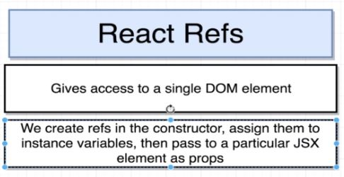

This project makes use of the Unsplash API for fetching images based on a search term.
It then display a list of images on a mosaic-like grid using React Refs.

## Topics covered

- Fetching data from an API
- Lifting state to App parent component
- CSS Grid
- Using React Refs to access DOM elements and pass properties as state to the component

### Notes

## Libs

- Axios
- Semantic UI

## API

- Unsplash

This project was bootstrapped with [Create React App](https://github.com/facebook/create-react-app).
